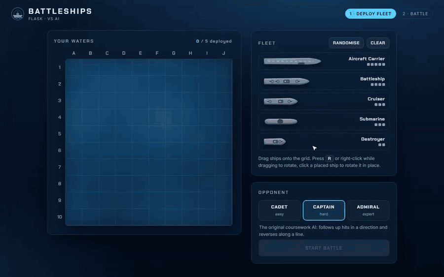
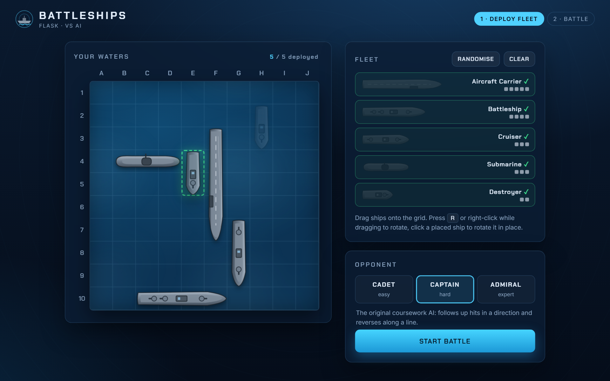
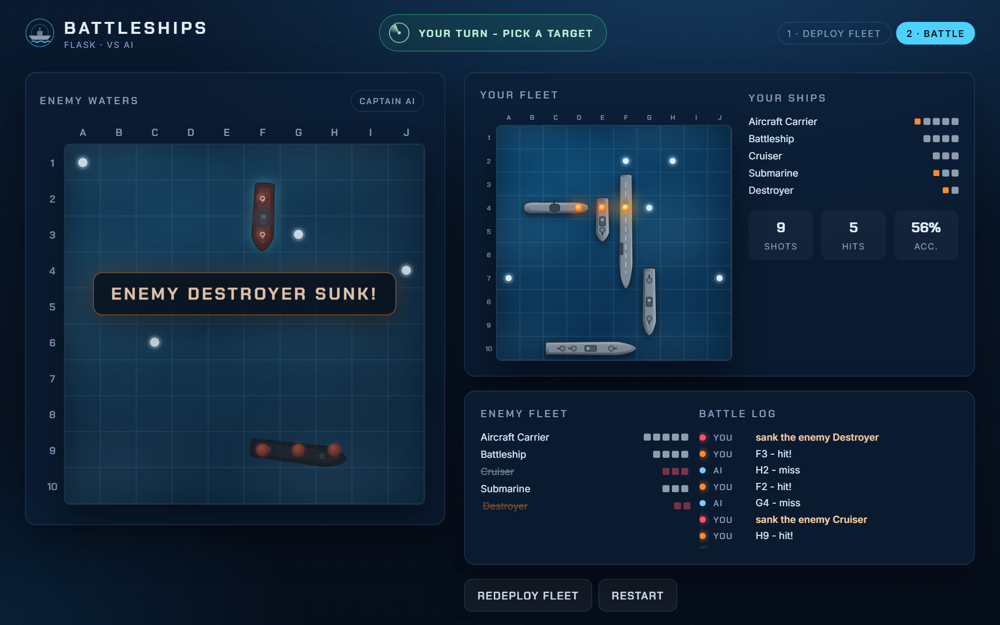
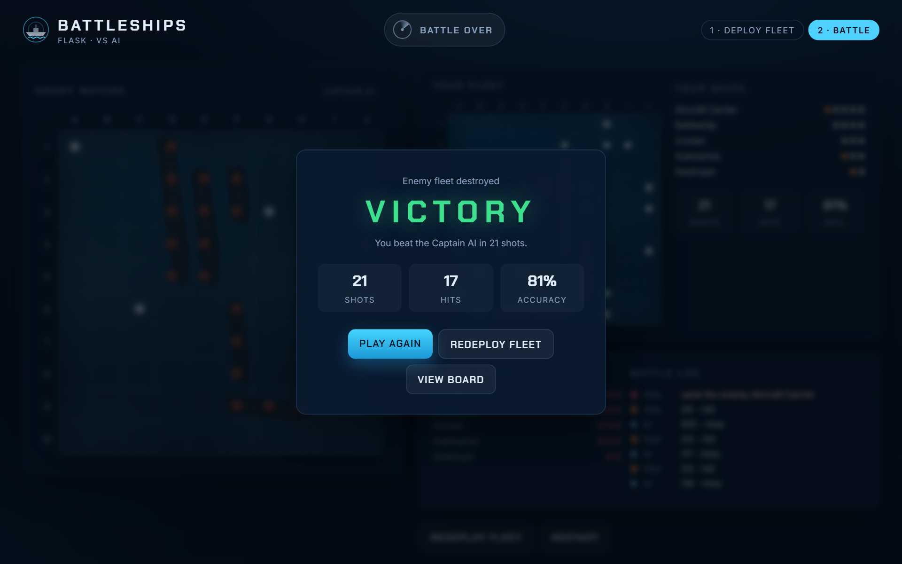
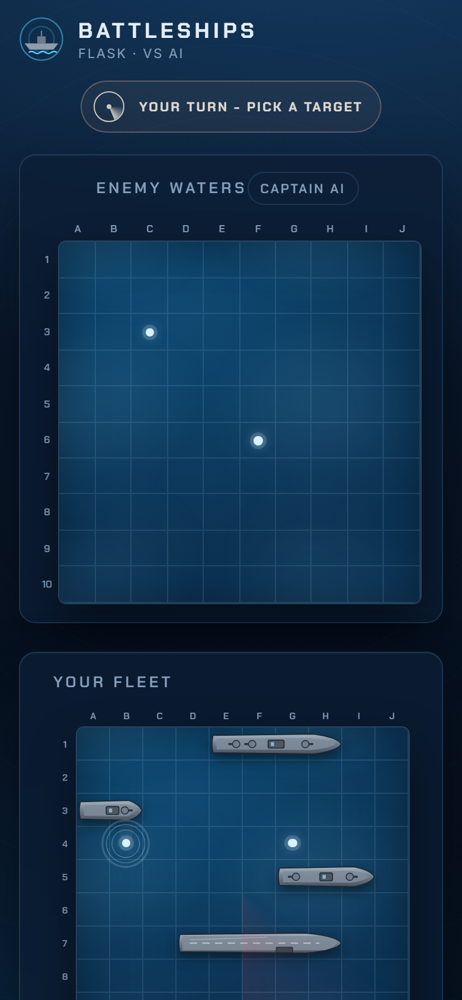
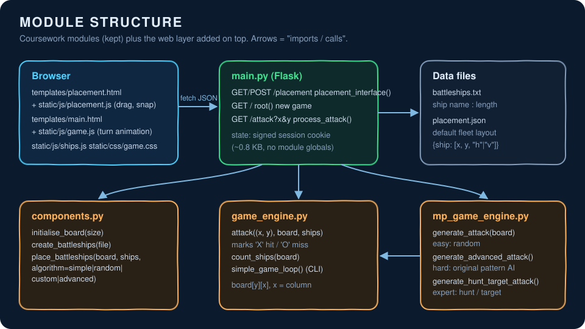
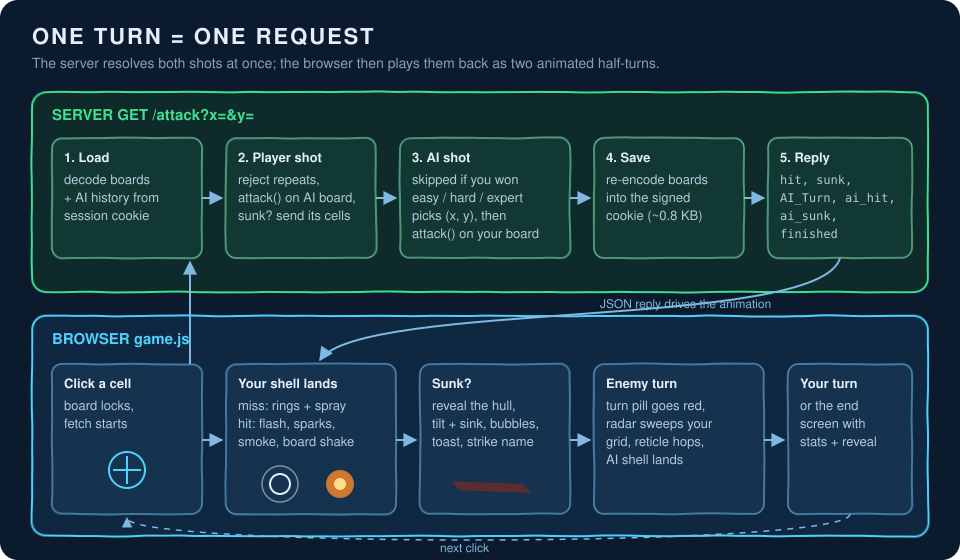

# Battleships

**Play it live:** https://battleships-gold.vercel.app

Battleships against an AI opponent, written in Python with a Flask web front end. You drag your fleet onto the grid, pick an opponent, and trade shots until one fleet is gone.



This started as my first-year coursework for ECM1400 (Programming) at the University of Exeter, submitted in December 2023. The brief fixed the module and function names (`components.py`, `game_engine.py`, `mp_game_engine.py`, `main.py`), the `battleships.txt` / `placement.json` formats and the provided test suite (`test_students.py`). The original deliverable was a CLI game plus two plain HTML pages served by Flask. In 2026 I went back to it: fixed the bugs, moved the game state out of module globals, added a third AI, and rebuilt the web UI. The rules and the coursework API are unchanged.

| Deploy your fleet | Mid battle |
|---|---|
|  |  |

| End of game | Phone layout |
|---|---|
|  |  |

## What it does

- **Placement**: drag ships from the dock onto a 10x10 grid. The drop target snaps to cells and turns red when the ship would overlap another or leave the board. Press `R` (or right-click) mid-drag to rotate, click a placed ship to rotate it in place, or hit Randomise. The server checks the placement again before accepting it.
- **Battle**: click a cell on the enemy grid. A shell drops onto the target, then you get a splash (miss) or an explosion with sparks, smoke and a board shake (hit). When a ship goes down, its hull shows up on the enemy grid, tilts and sinks, bubbles rise and the fleet list crosses it out. Then the turn pill goes red, a radar sweep crosses your grid and the AI's shell lands on your ships.
- **Three opponents**:
  - *Cadet* (`easy`): random placement, random shots that never repeat a cell.
  - *Captain* (`hard`): the AI I wrote for the coursework. It places large ships first and, after a hit, keeps shooting in one direction and turns back along the line when it misses.
  - *Admiral* (`expert`): a hunt/target AI I added later. In hunt mode it counts, for every unshot cell, how many ways the remaining ships could still lie across it, and fires at the best cell. After a hit it works along the line until the ship sinks. It only reads hit and miss marks and which ships are sunk, never the ship positions.
- **The CLI versions still work**: `python game_engine.py` (shoot at your own randomly placed fleet) and `python mp_game_engine.py` (you against the random AI).

Average number of shots each AI needs to sink a random fleet (200 games each, measured with the helpers in `test_web.py`):

| AI | Shots to win |
|---|---|
| Random (`generate_attack`) | 95.3 |
| Captain, the coursework AI (`generate_advanced_attack`) | 89.5 |
| Admiral, hunt/target (`generate_hunt_target_attack`) | 46.4 |

Honestly, the coursework AI does only a little better than random. It loses track of a ship once it changes direction a few times. The hunt/target AI needs about half as many shots.

## How it works



The coursework modules do the game logic. `main.py` is a thin Flask layer on top, and the browser code handles everything visual.



Each click is a single `GET /attack?x=&y=` request. The server resolves your shot and the AI's reply in one go and returns JSON (`hit`, `sunk`, `AI_Turn`, `ai_hit`, `ai_sunk`, `finished`). `game.js` then plays it back as two animated half-turns. The "enemy is targeting" pause is theatre: the AI's move is already decided when the reply arrives.

**State lives in the session cookie.** The coursework version kept both boards in module-level `global`s. That breaks as soon as two people play at once, and it cannot work on a serverless host where requests may land on different processes. Now each board is stored as a 100-character string (`.` water, `0`-`4` ship index, `X` hit, `O` miss), next to the untouched layouts (needed to know which cells a sunk ship covered) and the Captain AI's shot history. Flask signs and compresses the lot. A full game tops out around 0.8 KB of cookie.

## Quick start

Needs Python 3.10 or newer.

```bash
git clone https://github.com/duc-minh-droid/battleships
cd battleships
pip install -r requirements-dev.txt   # Flask + pytest
python main.py                        # http://127.0.0.1:5000/placement
```

`PORT=8123 python main.py` changes the port, and `SECRET_KEY=...` sets the session signing key (a fixed dev key is used if it is unset).

Run the tests (the original coursework suite plus the web and AI tests):

```bash
python -m pytest -q
```

CLI versions:

```bash
python game_engine.py      # single player against your own board
python mp_game_engine.py   # against the random AI
```

### Deploying to Vercel

Vercel detects the Flask `app` in `main.py` with no config file. Set `SECRET_KEY` in the project's environment variables. Because the game state is in the cookie, nothing depends on process memory.

- Root directory: repository root
- Framework preset: Other
- Build command: none
- Output directory: none
- Environment variable: `SECRET_KEY` (any long random string). Without it, sessions are signed with the public dev key.

## Project layout

```
components.py        board, fleet loading, placement algorithms (coursework API)
game_engine.py       attack(), count_ships(), single-player CLI loop
mp_game_engine.py    AI opponents + CLI game against the AI
main.py              Flask app: /placement, /, /attack, session encoding
battleships.txt      fleet definition (name:length)
placement.json       default fleet layout, used if you open / without placing ships
templates/           base.html, placement.html, main.html
static/css/game.css  theme, board, ship and effect animations
static/js/ships.js   board builder, SVG ship drawings, splash/explosion/bubble effects
static/js/placement.js  drag, snap, rotate, randomise
static/js/game.js    turn playback, fleet status, log, end screen
test_students.py     test suite provided with the coursework
test_web.py          HTTP game flow, placement validation and AI tests
docs/media/          demo, screenshots, diagrams, original 2023 screenshots
```

## Design notes

- **Coordinates are (x, y) = (column, row) everywhere**, with the board indexed `board[y][x]`. The coursework `attack()` indexed `board[x][y]` while placement and the web templates used `board[y][x]`, so the AI's hits on your fleet were recorded on the transposed cell and the "AI wins" check could be wrong. That is fixed, and `test_web.py` pins it down.
- Other bugs fixed from the 2023 version: `advanced` placement could silently drop a ship after 100 failed attempts. The Captain AI could aim off the board, crash on a `None` coordinate, or loop forever late in a game. The easy mode called `generate_attack(player_board)` on a function that took no arguments. And the AI still fired after you had already won.
- The UI has no build step and no framework: plain JS, CSS animations and inline SVG ships, so it runs straight from Flask's `static/` folder. Animations honour `prefers-reduced-motion`.
- The session cookie is signed, not encrypted. A determined player could decode it and read the enemy layout. That seemed acceptable for a portfolio game. Encrypting it, or keeping the AI board server side, would close the gap.
- The original 2023 screenshots (CLI and the plain HTML pages) are kept in `docs/media/original/` for comparison.

Author: Nguyen Duc Minh (Thomas).
